# Multi-Agent Data Assistant — Architecture & Documentation

> Capstone 2 | AI-08 | REVA University (RACE), Bengaluru  
> (Extends Capstone 1 with four objectives: Multi-Turn Memory · Security Hardening · Cross-Model Evaluator · Live Audit Dashboard)

---

## Table of Contents

1. [What This System Does](#1-what-this-system-does)
2. [System Architecture](#2-system-architecture)
3. [Project File Structure](#3-project-file-structure)
4. [LangGraph — Graph Structure & State](#4-langgraph--graph-structure--state)
5. [Worked Examples — Step-by-Step Traces](#5-worked-examples--step-by-step-traces)
6. [Agent Flow — How a Question Gets Answered](#6-agent-flow)
7. [Use Case Flows](#7-use-case-flows)
8. [Self-Correction Loop](#8-self-correction-loop)
9. [PDF Ingestion Pipeline](#9-pdf-ingestion-pipeline)
10. [RBAC — Role-Based Access Control](#10-rbac)
11. [Module Reference](#11-module-reference)
12. [Environment & Configuration](#12-environment--configuration)
13. [Running the System](#13-running-the-system)

> **See also:** [`er_diagram.md`](er_diagram.md) — full TPC-H ER diagram with FK reference and common join paths.

---

## 1. What This System Does

A non-technical user types a plain-English question into a chat interface.  
The system automatically decides **what kind of question it is**, routes it to the right agent, and returns a data table, chart, or text answer — all without the user writing any SQL.

**Three use cases it supports:**

| Use Case | Example | What happens |
|---|---|---|
| **KPI Definition** | "What is Average Order Value?" | Searches PDF knowledge base, returns definition |
| **KPI Computation** | "What is the Average Days to Ship for Q3 1996?" | Extracts KPI formula from PDF, then computes via SQL |
| **SQL Query** | "What was total revenue by nation in 1997?" | Generates & runs SQL on Databricks |

---

## Capstone 2 Additions

### Objective 1 — Multi-Turn Conversational Memory

`AgentState` now carries a `history` list (capped at `APP_HISTORY_TURNS = 4`).  
`agents/response_agent.py` appends each completed turn before returning.  
On the next Streamlit message, `app.py` seeds the graph with the saved history, and  
`config/prompts.py` injects it compactly into the SQL, KPI, and doc-answer prompts.

```
Turn N graph call
  ┌─────────────────────────────────┐
  │  initial state: history=[T1..TN-1] │
  │  sanitize_input → guardrail → …    │
  │  response_agent: append TN to history │
  │  final state: history=[T2..TN]    │  (oldest trimmed)
  └─────────────────────────────────┘
```

### Objective 2 — Security Hardening

**2a. Prompt Injection Sanitization** (`agents/sanitizer.py`)  
New first node in both graphs. Strips `INJECTION_PATTERNS` (configured in `config/settings.py`)  
and truncates to `APP_MAX_INPUT_CHARS = 500`. The `sanitize_text()` helper is also called by  
`retrieval_agent.py` on PDF chunks and `db/execute.py` on DB error strings before they reach any LLM prompt.

**2b. AST-Based SQL Write Guard** (`db/execute.py`)  
Replaced the old first-token string check with `sqlglot.parse_one(sql, dialect="databricks")`.  
Walks the full AST for `INSERT`, `UPDATE`, `DELETE`, `MERGE`, `GRANT`, `REVOKE`, `DROP`,  
`ALTER`, `CREATE`, `TRUNCATE` — catches them even inside a `WITH` clause. Fails closed  
if sqlglot cannot parse the statement.

### Objective 3 — Cross-Model Evaluator

`agents/evaluator.py` now uses `APP_MODEL_EVAL = "claude-sonnet-4-6"` (set in `config/settings.py`)  
instead of the generation model (Haiku). Same prompt, same 0–5 rubric — only the model changes.  
This eliminates the correlated self-grading bias documented in the Capstone 1 report.

### Objective 4 — Live Audit Monitoring Dashboard

`dashboard/monitoring.py` holds the rendering logic (charts live in `dashboard/_charts.py`,  
data loading in `dashboard/_data.py`). Queries `data_assistant.audit.query_audit_log` via the  
existing `db/connection.py`. Six charts: RBAC block rate over time, confidence score trend,  
self-correction frequency, average latency by intent, intent distribution, and HITL feedback  
distribution (see below). Read-only.

**Updated:** originally launched as a second, separate `streamlit run dashboard/monitoring.py`  
process on its own port (8503). Now exposed as a native Streamlit **multipage** entry —  
`pages/1_Monitoring_Dashboard.py` just calls `dashboard.monitoring.main()` — so it runs inside  
the same app/port as `app.py`. Both pages cross-navigate with `st.page_link()` instead of  
Streamlit's default sidebar page list: `app.py` → "📊 Open Monitoring Dashboard", dashboard →  
"⬅️ Back to Assistant". The default page list itself is turned off via  
`.streamlit/config.toml: [client] showSidebarNavigation = false` — an earlier attempt hid it  
with a `[data-testid="stSidebarNav"] { display: none; }` CSS override injected per-page, but  
that selector didn't reliably match the current DOM; the config-file flag is the actually-  
supported mechanism.

**HITL feedback loop (added after this objective shipped):** `utils/audit.py`'s audit table  
gained a `row_id` (`uuid4().hex`, generated per insert) and a `feedback` column. `log_query()`  
now returns the `row_id` it just wrote so the UI can reference that exact row later, and a new  
`update_feedback(row_id, "correct" | "incorrect")` runs a point `UPDATE ... WHERE row_id = ?`.  
`app.py: _render_feedback()` renders an `st.feedback("thumbs")` widget under every assistant  
message once its `row_id` is known. This is logged only for now — not wired into any  
auto-retry or self-correction loop — it feeds the same kind of manual  
"review flagged rows → add corrective examples → retrain" workflow already used for the intent  
classifier (Objective 5). `dashboard/_charts.py: chart_feedback_distribution()` renders it as a  
3-bar breakdown (Correct / Incorrect / No feedback) using a palette-validated 3-color set.

### Objective 5 (Stretch) — Trained Intent Classifier

The keyword-rule `agents/intent_classifier.py` was replaced with a trained model:

- `data/generate_intent_dataset.py` — asks Claude Sonnet for ~330 synthetic questions per  
  intent (doc_lookup / kpi_compute / sql_query), merges in the 38 real UAT questions, writes  
  `data/intent_training_data.json` (~1024 rows).
- `data/train_intent_classifier.py` — fits `TfidfVectorizer(1,2-grams) + LogisticRegression`  
  on an 85/15 stratified split, saves `data/intent_classifier.pkl`, and prints an accuracy  
  comparison against the old keyword classifier (now preserved unchanged as  
  `agents/intent_classifier_keyword.py`) run over the same held-out test set:

  | Classifier | Accuracy (154-question held-out test set) |
  |---|---|
  | TF-IDF + Logistic Regression | **96.8%** |
  | Keyword-rule (Capstone 1 baseline) | 62.3% |

- `agents/intent_classifier.py` now loads the pickled pipeline at import time and calls  
  `_pipeline.predict([question])`. **Limitation:** the model only sees the raw question text,  
  so a context-free follow-up like *"calculate it for last year?"* carries no signal that "it"  
  refers to the prior turn's KPI. An earlier version of this file handled that with a blunt rule  
  (≤6 words + prior turn `doc_lookup`/`kpi_compute` + a time/recompute keyword → force  
  `kpi_compute`) — **removed** after it broke a working case: *"How is it calculated?"* is  
  textbook `doc_lookup` phrasing the model already gets right alone (85.6% confidence), and the  
  blunt rule overrode it regardless. The model turned out to already resolve most bare  
  follow-ups correctly on its own — the synthetic training set had enough elliptical phrasing to  
  generalize. One narrower override remains (`_is_bare_kpi_continuation`), added for a  
  genuinely ambiguous case: *"compare 1995 vs 1996"* right after a KPI turn scores 46%  
  `kpi_compute` vs 49% `sql_query` from the model alone. It fires only when the model's own top  
  call was `sql_query`, the prior turn specifically was `kpi_compute` (not `doc_lookup`), and the  
  question names no ad-hoc entity of its own (nation/region/supplier/...) — *"compare revenue by  
  nation for 1995 vs 1996"* is left alone, since it introduces its own grouping dimension and the  
  model is confidently right (69%). This version no longer imports anything from  
  `agents/intent_classifier_keyword.py`.

### Related Bugfixes — Three Nodes Were History-Blind

Getting the same follow-up question — *"calculate it for last year?"* — to work end-to-end
took three separate fixes, one per pipeline stage, because each stage independently evaluated
the current question in isolation and had to be taught to fall back to `state["history"]`:

1. **`agents/guardrail.py`** (runs first): originally rejected the question as `out_of_scope`  
   because it has no domain keyword of its own. Fixed by letting non-off-topic questions  
   through once `state["history"]` is non-empty — safe because `history` only gets a turn  
   appended in `format_response`, which the graph never reaches for a blocked `out_of_scope`  
   question, so a non-empty history is proof the conversation is already anchored in-domain.
2. **`agents/intent_classifier.py`** (runs next): once the guardrail let it through, it was  
   misrouted to `sql_query` instead of `kpi_compute` — see Objective 5's follow-up override.
3. **`agents/retrieval_agent.py`** (runs after intent classification, before `kpi_agent`):  
   once routed to `kpi_compute`, the ChromaDB query embedded only the raw follow-up text, so  
   `kpi_agent`'s formula-extraction step found no relevant PDF chunk — there's no "AOV"/KPI  
   name in *"calculate it for last year?"* for the embedding search to match on. Fixed by  
   prepending the prior turn's question to the query text  
   (`f"{history[-1]['question']} {question}"` when history is non-empty, unchanged on a first  
   turn). `config/prompts.py: kpi_formula_extract_prompt()` was also updated to prefer a  
   formula already stated earlier in the history over a fresh (weaker) documentation match.

### Updated Graph Entry Point

```
Capstone 1:  guardrail → classify_intent → ...
Capstone 2:  sanitize_input → guardrail → classify_intent → ...
```

### Objective 6 (Stretch) — LangSmith Observability

**Problem it solves:** the audit dashboard (Objective 4) reports the *outcome* of a query —
intent, score, latency, cost — but not what happened *inside the graph* to produce it. There
was no way to inspect the exact prompt sent to the LLM at a given node, see both attempts in a
self-correction retry side by side, or confirm conversation history actually reached a prompt
rather than inferring it from the final answer looking plausible.

- **One-line change with app-wide effect:** `utils/llm_client.py`'s shared Anthropic client is
  wrapped — `llm_client = wrap_anthropic(anthropic.Anthropic(...))` from
  `langsmith.wrappers`. Every other file that calls `llm_client.messages.create(...)`
  (`sql_agent.py`, `kpi_agent.py`, `evaluator.py`, `response_agent.py`, the doc-answer node,
  even the offline `data/generate_intent_dataset.py`) needed **no changes** — they all already
  import the client from this one place.
- **LangGraph traces itself automatically.** Because the project already runs on LangGraph,
  enabling tracing via environment variables reports the full node-by-node execution path to
  LangSmith with no changes to `agents/orchestrator.py` at all — the graph structure is already
  visible to LangChain's tracing hooks.
- **An MLflow-based approach was tried first and removed.** Initial LLMOps work wired MLflow
  into `evaluation/run_eval.py` (experiment tracking — logging KPI metrics per eval run) and
  `tests/run_all_tests.py` (a 37/38 regression-gate threshold, accepting the known `AMT3`
  guardrail flake as a non-regression). The MLflow pieces were fully removed — package
  uninstalled, code reverted, generated `mlflow.db` deleted — after a scope decision to
  standardize on LangSmith for observability instead, since it instruments the *live app*
  itself rather than only offline batch-eval runs, and needs far less manual instrumentation
  code. The regression-gate threshold and its underlying `evaluation/scorer.py` bug fix
  (`r.get("eval_score", 0)` doesn't protect against a key that's present but `None` — only
  against a missing key) were kept, since they're independent of which tracing tool is used.
- **Config** (`.env`, template in `.env.example`): `LANGSMITH_TRACING=true`,
  `LANGSMITH_API_KEY`, `LANGSMITH_ENDPOINT` (this account is on the APAC regional deployment —
  `https://apac.smith.langchain.com` for the UI, `https://apac.api.smith.langchain.com` for the
  API endpoint, not the global default), `LANGSMITH_PROJECT=capstone2-multi-agent-assistant`.
  If `LANGSMITH_TRACING` is unset or not `"true"`, `wrap_anthropic()` is a no-op passthrough —
  the app runs identically with or without a configured account.
- **What a trace shows:** the full node chain for a question (e.g. `sanitize_input → guardrail →
  classify_intent → retrieve_context → load_schema → kpi_agent → format_response →
  evaluate_result`) as nested spans, with the actual wrapped LLM call inside each relevant node
  showing the full prompt, response text, token counts, latency, and which model (Haiku vs.
  Sonnet) handled it. A blocked `out_of_scope` question's trace visibly stops right after
  `guardrail`; a self-corrected SQL query's trace visibly contains two SQL-generation calls.
- **Free-tier limit:** LangSmith's free plan caps monthly trace volume. Each question produces
  several traces (one per graph node plus one per wrapped LLM call), so a full 38-case batch run
  consumes meaningfully more quota than casual manual testing.
- **Not yet connected:** the HITL `feedback` column (Objective 4) and LangSmith traces are
  separate systems — a trace isn't tagged with the audit table's `row_id`, so there's currently
  no way to jump from "a user marked this incorrect" to "here's exactly what the model saw."
  Noted as a possible future addition, not built.

---

## Visualisation

Every tile, chart, and table in the system, across both the chat UI (`app.py`) and the
monitoring dashboard (`dashboard/monitoring.py`, `dashboard/_charts.py`, `dashboard/_data.py`).
All dashboard charts are Streamlit-native elements (`st.bar_chart` / `st.line_chart` / native
`st.metric`) — no charting library beyond Streamlit itself, per the original scope rule
(no Pygwalker).

### Chat UI (`app.py`)

| # | Name | Type | Where | Data shown |
|---|---|---|---|---|
| 1 | Intent chip + confidence badge + elapsed time | Badge row | Under every assistant message (`_render_meta`) | Classified intent, 0–5 eval score (colour-coded `badge-0`…`badge-5`), latency in seconds |
| 2 | Query result table | Table (`st.dataframe`) | Under a `sql_query`/`kpi_compute` answer (`_render_dataframe`) | The raw result `DataFrame` returned by the SQL/KPI agent |
| 3 | Query result chart | Bar chart (`st.bar_chart`) | Same component, second tab — only shown when the result has exactly 2 columns and the 2nd is numeric | First column as categories, second as values (e.g. revenue by nation) |
| 4 | HITL feedback widget | Interactive control (`st.feedback("thumbs")`) | Under every assistant message (`_render_feedback`) | Not a data visualisation, but the input side of the feedback loop the dashboard's HITL chart (below) reports on |

### Monitoring Dashboard (`dashboard/monitoring.py`)

**15 KPI tiles** (`dashboard/_data.py: render_kpi_rows()`), 3 rows of 5, all `st.metric`:

| Row | Tile | Metric shown |
|---|---|---|
| Traffic & Safety | Total Queries | Row count in the selected window |
| Traffic & Safety | Blocked (score=0) | Count + % where `eval_score == 0` |
| Traffic & Safety | Out-of-Scope | Count where `intent == "out_of_scope"` |
| Traffic & Safety | Errors | Count where `error` is non-empty |
| Traffic & Safety | Success Rate (≥3/5) | % of rows with `eval_score >= 3` |
| Quality & Performance | Avg Confidence | Mean `eval_score`, out of 5 |
| Quality & Performance | Avg Latency | Mean `elapsed_sec` |
| Quality & Performance | P95 Latency | 95th-percentile `elapsed_sec` |
| Quality & Performance | Most Active Role | Mode of `user_role` |
| Quality & Performance | Top Intent | Mode of `intent` |
| Model & Cost | Total Tokens | `total_input_tokens + total_output_tokens`, summed |
| Model & Cost | Haiku Tokens | Generator-model tokens (all steps except `evaluator`) |
| Model & Cost | Sonnet Tokens | Evaluator-model tokens (the `evaluator` step only) |
| Model & Cost | Est. Haiku Cost | `haiku_tokens × Haiku 4.5 $/token` |
| Model & Cost | Est. Total Cost | Est. Haiku cost + est. Sonnet cost |

**10 charts** (`dashboard/_charts.py`), grouped under three `st.subheader`s:

| # | Section | Name | Chart type | Colour | What it shows |
|---|---|---|---|---|---|
| 1 | Activity | Query Volume Over Time | Bar | Blue `#3B82F6` | Queries per hour |
| 2 | Activity | Block Rate Over Time (%) | Line | Red `#EF4444` | Hourly % of queries with `eval_score == 0` |
| 3 | Activity | Avg Confidence Score (Hourly) | Line | Green `#10B981` | Hourly mean `eval_score` |
| 4 | Activity | Eval Score Distribution (0–5) | Bar | Indigo `#6366F1` | Histogram of `eval_score` values |
| 5 | Distribution | Intent Distribution | Bar | Amber `#F59E0B` | Query count per intent |
| 6 | Distribution | Query Volume by Role | Bar | Pink `#EC4899` | Query count per `user_role` |
| 7 | Distribution | Avg Latency by Intent (s) | Bar | Orange `#F97316` | Mean `elapsed_sec` grouped by intent |
| 8 | Distribution | HITL Feedback | Bar (3-colour) | `_FEEDBACK_COLORS` (validated triad) | Correct / Incorrect / No feedback counts |
| 9 | Model & Cost | Token Usage by Model (Hourly) | Line (2 series) | Purple `#8B5CF6` (Haiku) + Teal `#14B8A6` (Sonnet) | Hourly token sums split by generator vs. evaluator model |
| 10 | Model & Cost | Estimated Cost Over Time ($) | Line | Rose `#F43F5E` | Hourly estimated spend, Haiku + Sonnet combined |

**4 tables** (`dashboard/monitoring.py: _render_query_explorer()` + the raw-data expander), all `st.dataframe`:

| # | Name | Where | Contents |
|---|---|---|---|
| 1 | Recent Queries | Query Explorer, tab 1 | Last 50 queries (ts, question, role, intent, score, latency), keyword-searchable |
| 2 | Slowest Queries | Query Explorer, tab 2 | Top 20 by `elapsed_sec` descending |
| 3 | Blocked / Errors | Query Explorer, tab 3 | Rows with `eval_score == 0` or a non-empty `error` |
| 4 | Raw audit data | Bottom-of-page expander | Every column, every row in the selected window — unfiltered escape hatch |

---

## 2. System Architecture

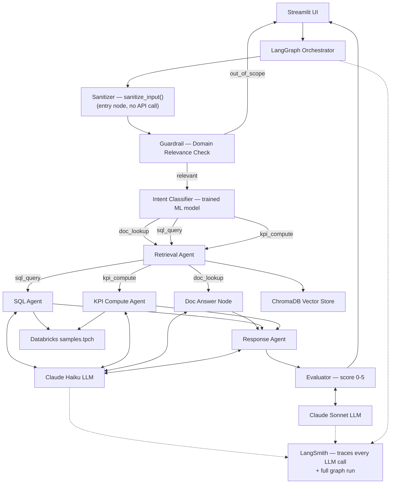

### High-Level Block Diagram

```mermaid
%%{init: {'themeVariables': {'fontSize': '28px'}}}%%
flowchart LR
    subgraph UserLayer["User Layer"]
        Browser["Browser / Streamlit"]
    end

    subgraph AppLayer["Application Layer"]
        ChatUI["Chat Interface"]
        Sidebar["Role Selector"]
    end

    subgraph AgentLayer["Agent Layer — LangGraph"]
        San["Sanitizer (entry node)"]
        GR["Guardrail"]
        IC["Intent Classifier — ML"]
        RA["Retrieval Agent"]
        subgraph SpecAgents["Specialized Agents"]
            SA["SQL Agent"]
            DocA["Doc Answer"]
            KpiA["KPI Agent"]
        end
        ResA["Response Agent"]
        Eval["Evaluator"]
    end

    subgraph DataLayer["Data Layer"]
        PDFs["PDF Docs"]
        ChromaDB["ChromaDB"]
    end

    subgraph DBLayer["Databricks Layer"]
        TPCH["samples.tpch"]
        AuditLog["Audit Log (Delta)"]
    end

    subgraph LLMLayer["LLM Layer"]
        Haiku["Claude Haiku"]
        Sonnet["Claude Sonnet"]
    end

    subgraph ObsLayer["Observability Layer"]
        LangSmith["LangSmith — traces every wrapped<br/>LLM call + the LangGraph run"]
    end

    subgraph CfgLayer["Config Layer"]
        RBAC["RBAC Config"]
    end

    Browser --> ChatUI
    Sidebar --> RBAC
    ChatUI --> San
    San --> GR
    GR -->|"relevant"| IC
    GR -->|"out_of_scope"| Browser
    IC --> RA
    RA --> SA & DocA & KpiA
    SA & DocA & KpiA --> ResA
    ResA --> Eval
    Eval --> Browser
    Eval --> AuditLog
    PDFs --> ChromaDB
    RA <--> ChromaDB
    SA & KpiA --> TPCH
    SA <--> Haiku
    DocA <--> Haiku
    KpiA <--> Haiku
    ResA <--> Haiku
    Eval <--> Sonnet
    Haiku -.->|"wrap_anthropic()"| LangSmith
    Sonnet -.->|"wrap_anthropic()"| LangSmith

    classDef agent fill:#1e3a5f,stroke:#38bdf8,color:#fff
    classDef llm fill:#3b1f5e,stroke:#a78bfa,color:#fff
    classDef data fill:#1a3a2a,stroke:#34d399,color:#fff
    classDef cfg fill:#3d2010,stroke:#fb923c,color:#fff
    classDef ui fill:#1f2937,stroke:#60a5fa,color:#fff
    classDef obs fill:#4a1d3d,stroke:#f472b6,color:#fff

    class San,GR,IC,RA,SA,DocA,KpiA,ResA,Eval agent
    class Haiku,Sonnet llm
    class ChromaDB,PDFs,TPCH,AuditLog data
    class RBAC cfg
    class Browser,ChatUI,Sidebar ui
    class LangSmith obs
```

---

## 3. Project File Structure

```
Capstone2_Implementation/
│
├── app.py                        ← Streamlit entry point (UI)
├── requirements.txt              ← Pinned dependencies
├── .env                          ← Secrets (never commit)
├── .env.example                  ← Safe template (commit this)
├── CLAUDE.md                     ← AI assistant context file
├── test.ipynb                    ← Scratch notebook
│
├── agents/                       ← All LangGraph agent nodes
│   ├── __init__.py
│   ├── state.py                  ← AgentState TypedDict (shared state)
│   ├── orchestrator.py           ← StateGraph wiring + routing logic
│   ├── sanitizer.py              ← sanitize_input() — the graph's actual entry node (Objective 2a):
│   │                                 strips prompt-injection patterns, truncates oversized input,
│   │                                 before anything else (including guardrail) touches the question
│   ├── guardrail.py              ← Domain relevance check — blocks off-topic queries (no API call);
│   │                                 passes non-off-topic follow-ups through once history is non-empty
│   ├── intent_classifier.py      ← Trained TF-IDF + LogisticRegression classifier (3 intents),
│   │                                 with one narrow override for a single ambiguous case
│   ├── intent_classifier_keyword.py ← Original keyword-rule classifier — kept only as the
│   │                                 accuracy-comparison baseline in train_intent_classifier.py
│   ├── retrieval_agent.py        ← ChromaDB semantic search (module-level singleton);
│   │                                 prepends prior turn's question to the query when history
│   │                                 is non-empty, so context-free follow-ups still retrieve
│   │                                 the right PDF chunk
│   ├── sql_agent.py              ← Haiku SQL generation + RBAC check
│   ├── kpi_agent.py              ← Hybrid RAG+SQL: extract KPI formula → compute SQL
│   ├── response_agent.py         ← Format final answer for UI
│   └── evaluator.py              ← Inline LLM-as-judge scoring node
│
├── db/                           ← All Databricks I/O
│   ├── __init__.py
│   ├── connection.py             ← get_connection() — reads .env
│   ├── schema.py                 ← Live schema pull filtered by role
│   └── execute.py                ← run_sql() + self-correction loop
│
├── config/
│   ├── __init__.py
│   ├── rbac.py                   ← Role → allowed tables mapping
│   ├── settings.py               ← Model name + token limits + audit table constants
│   └── prompts.py                ← Centralised LLM prompt builder functions
│
├── utils/
│   ├── __init__.py
│   ├── audit.py                  ← Delta audit logger: token tracking + per-query INSERT;
│   │                                 + row_id/feedback columns, log_query() returns row_id,
│   │                                 update_feedback() for the HITL thumbs feedback loop
│   └── llm_client.py             ← Shared Anthropic client, wrapped with langsmith.wrappers.
│                                     wrap_anthropic() — every LLM call app-wide traces to
│                                     LangSmith automatically (Objective 6), no other file changed
│
├── .streamlit/
│   └── config.toml               ← showSidebarNavigation = false (hides the default
│                                     multipage nav in favour of our own st.page_link buttons)
│
├── dashboard/
│   ├── __init__.py
│   ├── monitoring.py             ← Audit dashboard: 6 charts, time-window selector,
│   │                                 "⬅️ Back to Assistant" page_link; rendering only
│   ├── _charts.py                ← Individual chart builders, incl. HITL feedback distribution
│   └── _data.py                  ← Audit-table query/caching helpers
│
├── data/
│   ├── ingest.py                 ← One-time PDF → ChromaDB loader
│   ├── generate_intent_dataset.py ← One-time: Claude Sonnet generates ~1000 labeled training
│   │                                 questions + merges in real UAT questions
│   ├── train_intent_classifier.py ← Fits + evaluates the TF-IDF+LogReg pipeline, saves the .pkl
│   ├── intent_training_data.json ← ~1024 labeled (question, intent) training rows
│   ├── intent_classifier.pkl     ← Fitted sklearn pipeline, loaded by intent_classifier.py
│   ├── chroma_db/                ← Auto-created vector store
│   └── docs/                     ← Place PDF files here
│       ├── metrics_definitions.pdf
│       └── data_dictionary.pdf
│
├── pages/
│   └── 1_Monitoring_Dashboard.py ← Streamlit multipage entry — delegates to dashboard/monitoring.py
│
├── evaluation/
│   ├── __init__.py
│   ├── test_cases.py             ← 6 test cases (UC1–UC3 primary + UC4–UC6 supplementary)
│   ├── scorer.py                 ← Rule-based KPI scoring functions
│   └── run_eval.py               ← Offline eval runner, reports 5 KPIs
│
├── tests/
│   └── test_graph.py             ← End-to-end UC1/UC2/UC3 tests
│
└── documentation/
    ├── architecture.md           ← This file
    └── er_diagram.md             ← TPC-H ER diagram, FK reference, common join paths
```

---

## 4. LangGraph — Graph Structure & State

LangGraph is a library built on top of LangChain that lets you define agent pipelines as an explicit **directed graph** — each node is a Python function, edges define execution order, and conditional edges implement branching logic.

### 4a. The StateGraph

```
┌─────────────────────────────────────────────────────────────────┐
│                    LangGraph  StateGraph                        │
│                                                                 │
│   Entry ──► [guardrail]                                         │
│                    │                                            │
│          "out_of_scope"│"relevant"                              │
│               END ◄─┤├─► [classify_intent]                     │
│                         │                                       │
│             ┌───────────┼──────────────────────┐                │
│             │           │                      │                │
│        "sql_query" "doc_lookup"          "kpi_compute"          │
│             │           │                      │                │
│             └───────────┴──────────────────────┘                │
│                         │                                       │
│                  [retrieve_context]                             │
│                         │                                       │
│                   [load_schema]                                 │
│                         │                                       │
│             ┌───────────┼──────────────────────┐                │
│             │           │                      │                │
│        "sql_query" "doc_lookup"          "kpi_compute"          │
│             │           │                      │                │
│       [run_sql_  [answer_doc_           [kpi_agent]             │
│         agent]    question]                    │                │
│             │           │                      │                │
│             └───────────┴──────────────────────┘                │
│                         │                                       │
│              [format_response] ──► [evaluate_result] ──► END    │
└─────────────────────────────────────────────────────────────────┘
```

### 4b. Nodes and Their Roles

```
┌──────────────────────┬──────────────────────────────────────────────────────┐
│ Node                 │ What it does                                         │
├──────────────────────┼──────────────────────────────────────────────────────┤
│ sanitize_input       │ Entry node (Objective 2a) — no API call. Strips      │
│                      │ prompt-injection patterns ("ignore previous          │
│                      │ instructions", "system:", ...), truncates oversized  │
│                      │ input to APP_MAX_INPUT_CHARS. Runs before guardrail  │
│                      │ so nothing downstream ever sees the raw question.    │
├──────────────────────┼──────────────────────────────────────────────────────┤
│ guardrail            │ Keyword check — no API call, ~0ms.                   │
│                      │ If question has no TPC-H domain terms AND no         │
│                      │ definition keywords → sets intent="out_of_scope"     │
│                      │ and routes to END immediately. Prevents off-topic    │
│                      │ queries (e.g. "give me 2+2") from hitting            │
│                      │ ChromaDB or Databricks. Non-off-topic follow-ups     │
│                      │ pass through once state["history"] is non-empty.     │
├──────────────────────┼──────────────────────────────────────────────────────┤
│ classify_intent      │ Reads question, sets intent via a trained TF-IDF +   │
│                      │ LogisticRegression model (stretch objective — was    │
│                      │ keyword matching in Capstone 1). No API call — the   │
│                      │ model is a pickled sklearn pipeline loaded once at   │
│                      │ import time. One narrow rule-based override sits in  │
│                      │ front of it for a single case text alone can't       │
│                      │ resolve (see Objective 5 in Capstone 2 Additions).   │
├──────────────────────┼──────────────────────────────────────────────────────┤
│ retrieve_context     │ Queries ChromaDB with the question, stores top-3     │
│                      │ PDF chunks in state["doc_context"].                  │
│                      │ Uses a module-level singleton client — initialised   │
│                      │ once per process to avoid re-reading SQLite on       │
│                      │ every query (~1–3s saving).                          │
├──────────────────────┼──────────────────────────────────────────────────────┤
│ load_schema          │ Calls Databricks INFORMATION_SCHEMA, filters tables  │
│                      │ by RBAC role, stores in state["schema"].             │
│                      │ Uses a per-role in-memory cache — after the first    │
│                      │ query per role the schema is returned from cache     │
│                      │ (~4–10s saving on subsequent queries).               │
├──────────────────────┼──────────────────────────────────────────────────────┤
│ answer_doc_question  │ Sends doc_context + question to Haiku, stores        │
│                      │ plain-English answer in state["final_answer"].       │
├──────────────────────┼──────────────────────────────────────────────────────┤
│ run_sql_agent        │ Generates SQL via Haiku, validates RBAC, executes    │
│                      │ with self-correction. Stores DataFrame in state.     │
├──────────────────────┼──────────────────────────────────────────────────────┤
│ kpi_agent            │ Two-step hybrid RAG+SQL node:                        │
│                      │ Step 1 — sends doc_context + question to Haiku to    │
│                      │   extract the KPI formula from PDF text              │
│                      │   e.g. "AOV = total revenue / number of orders"      │
│                      │ Step 2 — builds SQL prompt using extracted formula   │
│                      │   + schema + time filter from question. Generates    │
│                      │   and executes SQL with self-correction loop.        │
│                      │ Bridges RAG knowledge base → SQL computation.        │
│                      │ Handles: "What is Average Days to Ship for Q3 1996?", │
│                      │          "What was gross margin in 1997?"            │
├──────────────────────┼──────────────────────────────────────────────────────┤
│ format_response      │ Routes to error / summary / doc answer depending on  │
│                      │ state. Calls Haiku for DataFrame summarisation if    │
│                      │ intent = sql_query. Appends the completed turn to    │
│                      │ state["history"] (Objective 1).                     │
├──────────────────────┼──────────────────────────────────────────────────────┤
│ evaluate_result      │ Inline LLM-as-judge — scores the answer 0-5.         │
│                      │ Uses Claude Sonnet (APP_MODEL_EVAL), not Haiku       │
│                      │ (Objective 3 — cross-model evaluator, so the same    │
│                      │ model never grades its own output). Final node       │
│                      │ before END; result gets written to the audit table.  │
└──────────────────────┴──────────────────────────────────────────────────────┘
```

Every node above that calls `llm_client` (i.e. every node except `sanitize_input`, `guardrail`, and
`classify_intent`) traces automatically to LangSmith — see Objective 6 in Capstone 2 Additions.

### 4c. Conditional Edges (Routing Logic)

```
sanitize_input
    └── always                            ──► guardrail

guardrail
    ├── state["intent"] == "out_of_scope" ──► END   (no Databricks, no LLM)
    └── intent not set yet               ──► classify_intent

classify_intent
    ├── state["intent"] == "sql_query"   ──► retrieve_context
    ├── state["intent"] == "doc_lookup"  ──► retrieve_context
    └── state["intent"] == "kpi_compute" ──► retrieve_context

load_schema
    ├── state["intent"] == "sql_query"   ──► run_sql_agent
    ├── state["intent"] == "doc_lookup"  ──► answer_doc_question
    └── state["intent"] == "kpi_compute" ──► kpi_agent
```

### 4d. AgentState — Shared Memory Between Nodes

Every node receives the full state dict and returns an updated copy. Keys accumulate as the graph executes.

```
AgentState (TypedDict)
│
├── question       : str   ← set by app.py before graph.invoke()
├── user_role      : str   ← set by app.py before graph.invoke()
│
├── intent         : str   ← set by guardrail / classify_intent
│                            "sql_query" | "doc_lookup" | "kpi_compute" | "out_of_scope"
│
├── doc_context    : str   ← set by retrieve_context
├── schema         : dict  ← set by load_schema
│
├── generated_sql  : str   ← set by run_sql_agent
├── result_df      : Any   ← set by run_sql_agent (pandas DataFrame)
│
├── final_answer   : str   ← set by answer_doc_question / get_metadata
│                            overwritten by format_response
│
├── error          : str   ← set by run_sql_agent on RBAC/SQL failure
│
├── eval_score     : int   ← set by evaluate_result (0–5 confidence)
├── eval_notes     : list  ← set by evaluate_result (e.g. ["empty result"])
├── token_usage    : dict  ← accumulated across all LLM calls
│                             {total_input, total_output, calls:[{step,input,output}]}
└── kpi_formula    : str   ← set by kpi_agent Step 1 (extracted formula from PDF)
                              e.g. "AOV = SUM(o_totalprice) / COUNT(o_orderkey)"
```

State at each stage of a SQL query:

```
BEFORE graph.invoke():
  question  = "What was total revenue by nation last year?"
  user_role = "finance"
  (all other keys absent)

AFTER classify_intent:
  + intent = "sql_query"

AFTER retrieve_context:
  + doc_context = "Revenue is defined as... [PDF chunk 1]\n---\n..."

AFTER load_schema:
  + schema = {
      "samples.tpch.orders":   [{column: "o_orderkey", type: "BIGINT"}, ...],
      "samples.tpch.lineitem": [{column: "l_orderkey", type: "BIGINT"}, ...],
      ...
    }

AFTER run_sql_agent:
  + generated_sql = "SELECT n.n_name, SUM(...) FROM lineitem l JOIN ..."
  + result_df     = DataFrame(25 rows × 2 cols)
  + error         = ""

AFTER format_response:
  + final_answer  = "ALGERIA led with $4.2B in revenue, followed by..."
```

---

## 5. Worked Examples — Step-by-Step Traces

### Example 1 — "What is Average Order Value?" (analyst role)

```
USER INPUT
  question  : "What is Average Order Value?"
  user_role : "analyst"

──────────────────────────────────────────────────
NODE 1: classify_intent
  Checks: "what is" → doc keyword ✓
          no SQL override keyword matches
  Result: intent = "doc_lookup"

──────────────────────────────────────────────────
NODE 2: retrieve_context
  ChromaDB query: "What is Average Order Value?"
  Returns top-3 chunks from metrics_definitions.pdf:
    chunk_1: "Average Order Value (AOV) is calculated by dividing
              total revenue by the number of orders placed..."
    chunk_2: "AOV is a key e-commerce KPI used to measure..."
    chunk_3: "To improve AOV, businesses typically use..."
  Result: doc_context = chunk_1 + "---" + chunk_2 + "---" + chunk_3

──────────────────────────────────────────────────
NODE 3: load_schema
  (runs but result not used for doc_lookup path)

──────────────────────────────────────────────────
NODE 4: answer_doc_question
  Sends to Claude Haiku:
    "Answer using ONLY the context below:
     [doc_context]
     Question: What is Average Order Value?"
  Result: final_answer = "Average Order Value (AOV) is total revenue
                          divided by the number of orders. It is a key
                          metric for measuring customer spend..."

──────────────────────────────────────────────────
NODE 5: format_response
  intent = "doc_lookup", error = ""
  → passes final_answer through unchanged

OUTPUT TO UI
  answer  : "Average Order Value (AOV) is total revenue divided by..."
  intent  : "doc_lookup"
  elapsed : ~1.8s
  sql     : (none)
  chart   : (none)
```

---

### Example 2 — "What was total revenue by nation last year?" (finance role)

```
USER INPUT
  question  : "What was total revenue by nation last year?"
  user_role : "finance"

──────────────────────────────────────────────────
NODE 1: classify_intent
  Checks: "total" → SQL override keyword ✓
  Result: intent = "sql_query"

──────────────────────────────────────────────────
NODE 2: retrieve_context
  ChromaDB query: "total revenue by nation"
  Returns 3 chunks about revenue definitions from PDFs
  Result: doc_context = "Revenue is defined as extended price..."

──────────────────────────────────────────────────
NODE 3: load_schema
  finance role allowed tables:
    orders, lineitem, supplier, partsupp, nation
  Fetches live column info from Databricks INFORMATION_SCHEMA
  Result: schema = {
    "samples.tpch.orders":   [o_orderkey BIGINT, o_orderdate DATE, ...],
    "samples.tpch.lineitem": [l_orderkey BIGINT, l_extendedprice DECIMAL, ...],
    "samples.tpch.nation":   [n_nationkey INT, n_name VARCHAR, ...]
  }

──────────────────────────────────────────────────
NODE 4: run_sql_agent
  Builds prompt with schema + doc_context + date rule (1992–1998)
  Claude Haiku generates:
    SELECT n.n_name,
           SUM(l.l_extendedprice * (1 - l.l_discount)) AS total_revenue
    FROM samples.tpch.lineitem l
    JOIN samples.tpch.orders o   ON l.l_orderkey  = o.o_orderkey
    JOIN samples.tpch.nation n   ON o.o_custkey   = n.n_nationkey
    WHERE YEAR(o.o_orderdate) = 1997
    GROUP BY n.n_name
    ORDER BY total_revenue DESC

  RBAC check: all 3 tables in allowed list ✓
  Databricks execution: success on first attempt
  Result: result_df = DataFrame(25 rows × 2 cols)
          generated_sql = "SELECT n.n_name, SUM(...)"
          error = ""

──────────────────────────────────────────────────
NODE 5: format_response
  intent = "sql_query", error = "", result_df not empty
  Calls Haiku to summarise DataFrame:
    → "ALGERIA led with $4.1B in revenue in 1997, followed by
       ETHIOPIA ($3.9B) and IRAN ($3.8B)..."
  Result: final_answer = summary text

OUTPUT TO UI
  answer  : "ALGERIA led with $4.1B in revenue..."
  table   : 25-row DataFrame
  chart   : bar chart (2 columns: n_name + total_revenue)
  sql     : SELECT n.n_name, SUM(...) [shown in expander]
  intent  : "sql_query"
  elapsed : ~6.3s
```

---

### Example 3 — RBAC Violation (finance role asking for customer data)

```
USER INPUT
  question  : "Show me top 10 customer names by order value in 1997"
  user_role : "finance"

──────────────────────────────────────────────────
NODE 1: classify_intent
  "show me" + "top" → SQL override keywords ✓
  Result: intent = "sql_query"

──────────────────────────────────────────────────
NODE 2: retrieve_context  →  doc_context loaded

NODE 3: load_schema
  finance allowed: orders, lineitem, supplier, partsupp, nation
  (customer NOT in schema)

──────────────────────────────────────────────────
NODE 4: run_sql_agent
  Haiku generates SQL referencing samples.tpch.customer
  _check_rbac() scans SQL:
    "samples.tpch.customer" found in SQL but NOT in allowed list
    → raises PermissionError

  Caught in except block:
    generated_sql = ""
    result_df     = None
    error         = "RBAC violation: role 'finance' is not allowed
                     to access: ['samples.tpch.customer']"

──────────────────────────────────────────────────
NODE 5: format_response
  error is non-empty → final_answer = "Something went wrong: RBAC..."

OUTPUT TO UI
  🔴 st.error("RBAC violation: role 'finance' is not allowed...")
  intent  : "sql_query"
  elapsed : ~2.1s
```

---

## 6. Agent Flow

Every question travels through the same LangGraph pipeline. The **intent** decides which branch it takes.

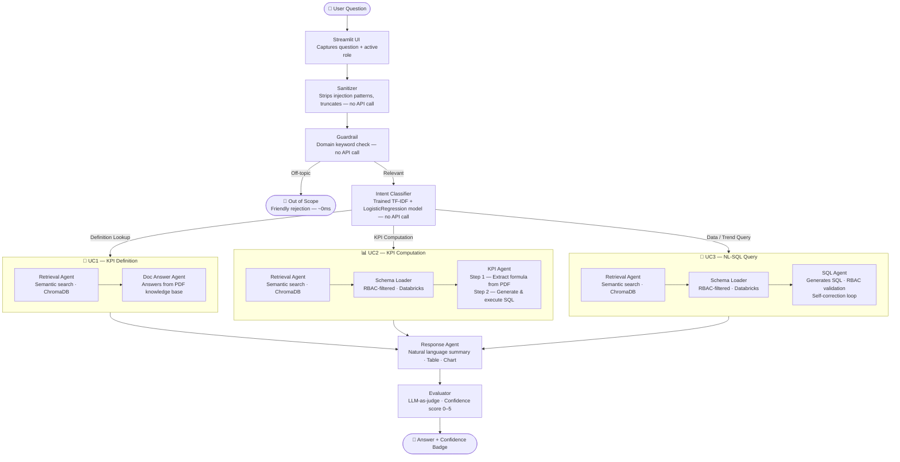

---

## 7. Use Case Flows

### UC1 — KPI Definition (analyst role)

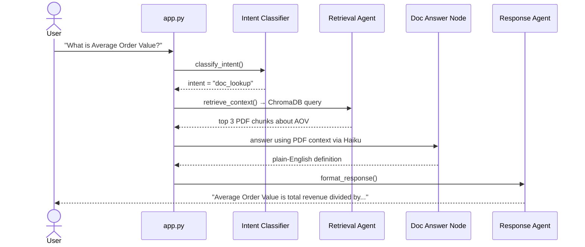

---

### UC2 — KPI Computation (analyst role)

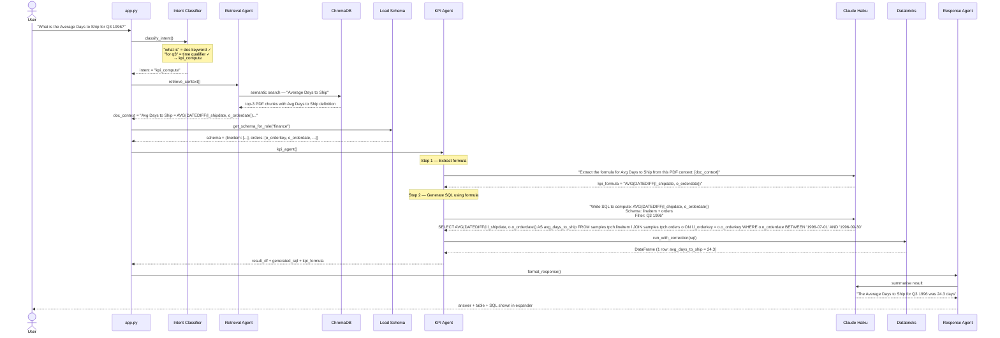

---

### UC3 — NL-SQL Query (finance role)

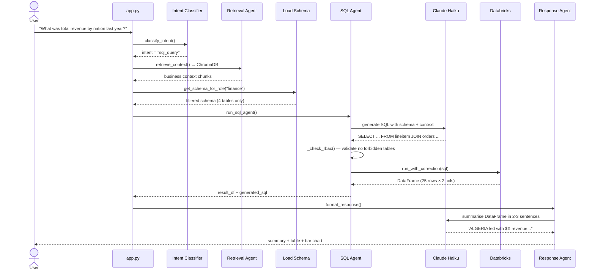

---

## 8. Self-Correction Loop

When the SQL Agent's generated query fails on Databricks, it automatically asks Haiku to fix it — up to 2 times.

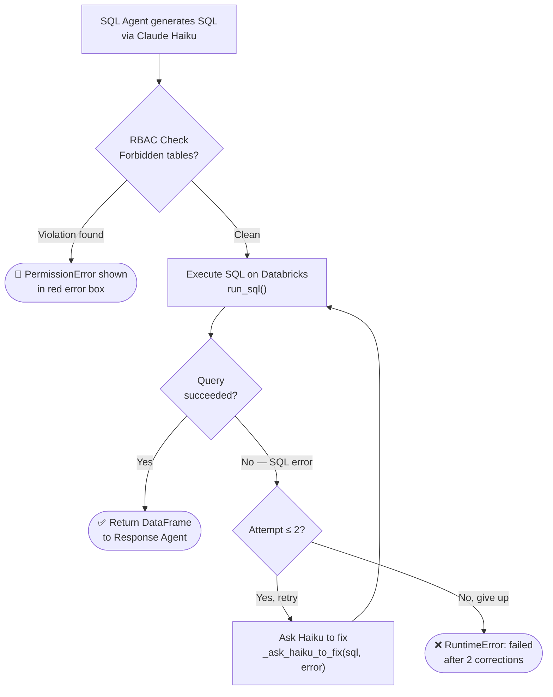

---

## 9. PDF Ingestion Pipeline

This is a **one-time setup** step. Run `python data/ingest.py` before launching the app.

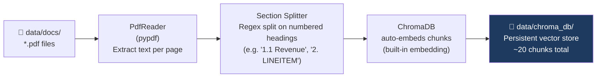

**Why section-based chunking?** PyPDF produces single-newline text with no paragraph breaks, so character-based splitting at 400 chars cut metric definitions mid-sentence (formula on one chunk, tables used on the next). Splitting on numbered section headings (`1.1 Total Revenue`, `2. LINEITEM`, etc.) keeps each KPI definition or table spec in one self-contained chunk. Result: 20 coherent chunks vs. ~57 fragmented ones previously.

**Chunk settings** (all defined in `config/settings.py`):

| Setting | Constant | Value | Notes |
|---|---|---|---|
| Max chunk size | `CHUNK_SIZE` | 800 characters | Guide for merge threshold — not used by section splitter |
| Overlap | `CHUNK_OVERLAP` | 0 | Section boundaries are natural delimiters |
| Embedding model | — | ChromaDB default (all-MiniLM) | |
| Collection name | `CHROMA_COLLECTION` | `knowledge_base` | |
| Storage path | `CHROMA_PATH` | `data/chroma_db/` | |
| Results returned | `CHROMA_N_RESULTS` | 3 | Top-3 chunks per query |

> **Re-ingest required** after changing chunk strategy: `python -m data.ingest` (run from project root).

---

## 10. RBAC

Access control is enforced at **two points**:
1. **Schema filtering** — only allowed table schemas are sent to the LLM (so it can't generate SQL for forbidden tables)
2. **Post-generation check** — `_check_rbac()` in `sql_agent.py` scans the generated SQL for forbidden table references before execution

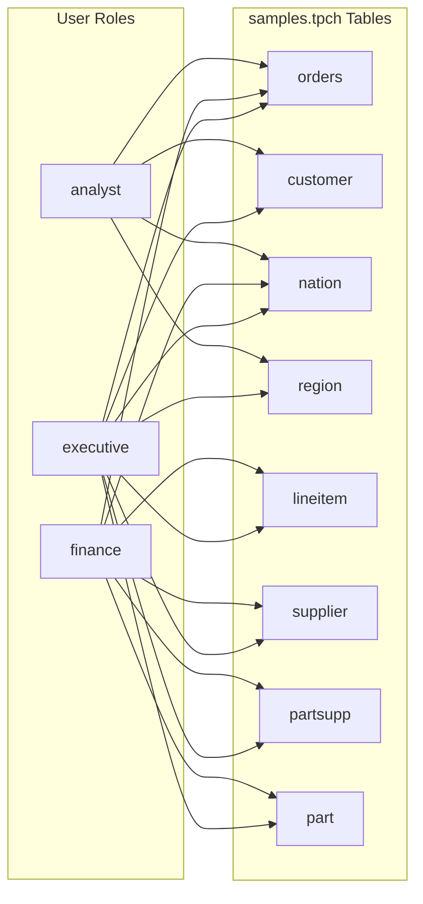

**Role summary:**

| Role | Tables Accessible | Use Case |
|---|---|---|
| `analyst` | orders, customer, nation, region | Sales & customer analysis |
| `finance` | orders, lineitem, supplier, partsupp, nation, part | Financial & supply chain |
| `executive` | All 8 tables | Full access |

---

## 11. Module Reference

### `agents/state.py` — Shared State

The `AgentState` TypedDict is passed between every node in the graph. Each agent reads from it and returns an updated copy.

```
AgentState
├── question       str    — original user question
├── user_role      str    — "analyst" | "finance" | "executive"
├── intent         str    — "sql_query" | "doc_lookup" | "kpi_compute"
├── doc_context    str    — top-3 PDF chunks joined by ---
├── schema         dict   — {table_name: [{column, type}, ...]}
├── generated_sql  str    — SQL produced by Haiku
├── result_df      Any    — pandas DataFrame from Databricks
├── final_answer   str    — formatted answer for the UI
├── error          str    — RBAC or execution error message
├── eval_score     int    — 0–5 confidence score from evaluate_result node
├── eval_notes     list   — human-readable flags from evaluator
├── token_usage    dict   — {total_input, total_output, calls:[{step,input,output}]}
└── kpi_formula    str    — KPI formula extracted from PDF (kpi_compute path only)
                            e.g. "AOV = SUM(o_totalprice) / COUNT(o_orderkey)"
```

---

### `agents/guardrail.py` — Domain Relevance Check

No API calls. Pure keyword matching. Runs as the **first node** in both graphs.

```
Input : state["question"], state["history"]
Output: state unchanged (relevant) OR state["intent"] = "out_of_scope" (blocked)

Decision logic:
  1. Lowercase the question
  2. Check OFF_TOPIC_MARKERS (weather, sports, movies, ...) → always blocks, even
     if a domain word appears incidentally
  3. Check for any DOMAIN_KEYWORDS (order, revenue, supplier, nation, trend, etc.)
  4. Check for DOC_KEYWORDS (what is, how is, define, explain, etc.)
  5. If EITHER matches → relevant, pass through to classify_intent
  6. If history is non-empty (a prior turn already passed the guardrail this
     session) → relevant, pass through — a short follow-up like "for last
     year?" carries no domain keyword of its own but is still anchored to
     the ongoing in-domain conversation
  7. Otherwise → out_of_scope, route to END immediately

Cost of a block : ~0ms, zero API calls, zero Databricks connections
Cost of a miss  : ChromaDB returns no relevant chunks, LLM responds gracefully
```

**Why definition questions (`what is X?`) get a pass:** even if `X` is not in the domain keyword list, a ChromaDB miss is cheap — the LLM just responds "no relevant documentation found." The false-positive cost is low, so we avoid incorrectly blocking legitimate definition questions.

**Why history alone is enough to pass a question through (step 6):** `state["history"]` only
gets a turn appended by `response_agent.py`'s `format_response` node, which the graph never
reaches for a blocked `out_of_scope` question (the conditional edge routes straight to `END`
from the guardrail). So a non-empty history is proof this session's conversation is already
anchored in the TPC-H domain — an explicit topic pivot still gets caught by step 2's
`OFF_TOPIC_MARKERS` check, which runs first.

---

### `agents/intent_classifier.py` — Intent Detection (Trained Model)

**Stretch objective — replaced the keyword-rule classifier.** No live API call at inference
time (the model is a pickled sklearn pipeline loaded once at import). The model runs first;
one narrow override can override its output for a single ambiguous case.

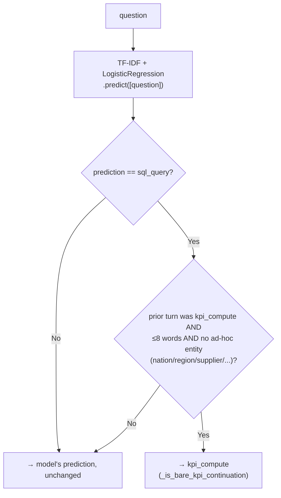

- **Model:** `TfidfVectorizer(ngram_range=(1,2)) + LogisticRegression(class_weight="balanced")`,
  trained offline in `data/train_intent_classifier.py` on `data/intent_training_data.json`
  (~1039 rows: ~330 Claude-Sonnet-generated examples per intent + the 38 real UAT questions +
  15 hand-corrective examples added after testing found two specific misclassification
  patterns), saved to `data/intent_classifier.pkl`.
- **Measured accuracy** on a held-out test set: **~96%**, vs. **~63%** for the old keyword
  classifier run over the same set (now preserved as `agents/intent_classifier_keyword.py`,
  used only as the comparison baseline in the training script).
- **An earlier, blunter override was removed.** The first version force-routed to `kpi_compute`
  whenever a question was ≤6 words, the prior turn was `doc_lookup` or `kpi_compute`, and it had
  a time/recompute keyword. That broke *"How is it calculated?"* right after a `doc_lookup`
  turn — textbook definition phrasing the model already classifies correctly alone (85.6%
  confidence) — because the blunt rule overrode it regardless. Testing showed the model already
  resolves most bare follow-ups correctly by itself (the synthetic training data had enough
  elliptical phrasing to generalize), so the override was narrowed instead of discarded.
- **The remaining override** (`_is_bare_kpi_continuation`) targets one specific gap: a question
  like *"compare 1995 vs 1996"* right after a KPI-computation turn scores 46% `kpi_compute` vs.
  49% `sql_query` from the model alone — "compare" reads as an ad-hoc aggregation cue in the
  training data, and the model has no visibility into conversation history to know it's
  continuing the same KPI. It only fires when **all** of: the model's own prediction was
  `sql_query`, the prior turn was specifically `kpi_compute` (not `doc_lookup` — a doc follow-up
  should stay a doc follow-up), and the question names no ad-hoc entity word of its own. A
  question like *"compare revenue by nation for 1995 vs 1996"* is left alone — it introduces its
  own grouping dimension and the model is confidently right (69%) without help.
- **Why `kpi_compute` and not `sql_query` when the override fires:** `kpi_agent.py` grounds its
  SQL in the documented KPI formula extracted via RAG first; `sql_agent.py` writes ad-hoc SQL
  with no such grounding. Routing an ungrounded follow-up to `sql_query` risks a
  plausible-looking number that doesn't match the KPI's actual definition.

> **Retraining:** `python data/generate_intent_dataset.py` (regenerates the training set via
> Claude Sonnet) then `python data/train_intent_classifier.py` (retrains, prints the accuracy
> report and the ML-vs-keyword comparison, overwrites `intent_classifier.pkl`).

---

### `agents/sql_agent.py` — SQL Generation

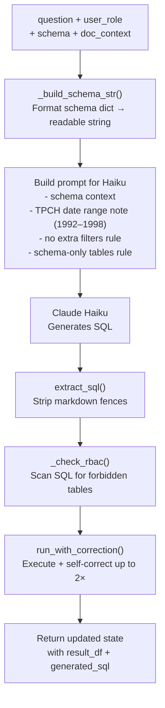

---

### `db/execute.py` — SQL Execution

| Function | Purpose |
|---|---|
| `run_sql(sql)` | Blocks destructive commands (DELETE/DROP/TRUNCATE/UPDATE/INSERT/ALTER/CREATE/REPLACE); executes and returns a pandas DataFrame |
| `extract_sql(text)` | Strips ` ```sql ``` ` fences from LLM output |
| `_ask_haiku_to_fix(sql, error, question)` | Sends broken SQL + error to Haiku for correction |
| `run_with_correction(sql, question)` | Retry loop: runs SQL, calls fix on failure, max 2 retries |

> `run_sql()` raises `ValueError` immediately if the query starts with a destructive command (`DELETE`, `DROP`, `TRUNCATE`, `UPDATE`, `INSERT`, `ALTER`, `CREATE`, `REPLACE`) — before a connection is opened. Read-only commands like `SELECT` and `DESCRIBE` are allowed. This is a code-level safety net independent of the LLM prompt instruction.

---

### `utils/audit.py` — Audit Logger

Every query is logged to a Databricks Delta table (`data_assistant.audit.query_audit_log`) automatically after the graph completes.

**Functions:**

| Function | Purpose |
|---|---|
| `add_tokens(current, step, usage)` | Merges one LLM call's `response.usage` into the running `token_usage` dict in state |
| `_ensure_table()` | Runs `CREATE CATALOG / SCHEMA / TABLE IF NOT EXISTS` on first call (idempotent); also `ALTER TABLE ADD COLUMN` for any columns added after the table already existed |
| `log_query(question, user_role, result) -> str \| None` | Inserts one row into the Delta table, generating a `uuid4().hex` `row_id` for it. Catches all exceptions and prints a warning — never crashes the UI. Returns the `row_id` (or `None` on failure) so the caller can attach feedback to this exact row later |
| `update_feedback(row_id, feedback)` | HITL hook — `UPDATE ... SET feedback = ? WHERE row_id = ?`. Logged only for now; not wired into any auto-retry/self-correction path |

**Delta table schema (`data_assistant.audit.query_audit_log`):**

| Column | Type | Description |
|---|---|---|
| `ts` | TIMESTAMP | UTC time of the query |
| `question` | STRING | User's input |
| `user_role` | STRING | analyst / finance / executive |
| `intent` | STRING | Classified intent |
| `eval_score` | INT | 0–5 LLM-as-judge score |
| `eval_notes` | STRING | JSON array of evaluator flags |
| `elapsed_sec` | DOUBLE | End-to-end latency |
| `error` | STRING | Error message if any |
| `generated_sql` | STRING | SQL produced by Haiku (if applicable) |
| `answer_preview` | STRING | First 200 chars of final answer |
| `total_input_tokens` | INT | Sum of input tokens across all LLM calls |
| `total_output_tokens` | INT | Sum of output tokens across all LLM calls |
| `token_calls` | STRING | JSON array of per-step token breakdown |
| `generator_model` | STRING | `APP_MODEL` (Haiku) — the generation model for this turn |
| `evaluator_model` | STRING | `APP_MODEL_EVAL` (Sonnet) — the judge model for this turn |
| `row_id` | STRING | `uuid4().hex`, generated per insert — lets HITL feedback target this exact row |
| `feedback` | STRING | `"correct"` / `"incorrect"` / `NULL` — set via `update_feedback()` from the UI's thumbs widget |

**Token tracking — which steps contribute:**

| Step key | Agent | LLM call purpose |
|---|---|---|
| `sql_generation` | `sql_agent.py` | Generate SQL from question |
| `sql_fix` | `db/execute.py` | Fix broken SQL (only on retry) |
| `doc_answer` | `orchestrator.py` | Answer from PDF context |
| `df_summary` | `response_agent.py` | Summarise DataFrame in plain English |
| `evaluator` | `evaluator.py` | Score answer relevance 1–5 |
| `kpi_formula` | `kpi_agent.py` | Extract KPI formula from PDF (Step 1) |
| `kpi_sql` | `kpi_agent.py` | Generate SQL using formula (Step 2) |

---

### `utils/llm_client.py` — Shared Anthropic Client (LangSmith-wrapped)

Every agent file imports `llm_client` from here rather than constructing its own
`anthropic.Anthropic()` instance — one client, one retry/timeout config, one place to add
cross-cutting behavior like tracing.

```python
llm_client = wrap_anthropic(anthropic.Anthropic(
    api_key=os.getenv("ANTHROPIC_API_KEY"),
    max_retries=4,
    timeout=60.0,
))
```

`wrap_anthropic()` (from `langsmith.wrappers`, Objective 6) means every `.messages.create(...)`
call made anywhere in the app — through this one shared client — automatically traces to
LangSmith: full prompt, response, token usage, latency, model name. No other file needed to
change to get this. If `LANGSMITH_TRACING` isn't `"true"` in the environment, the wrapper is a
transparent no-op and every call behaves exactly as it did before Objective 6.

---

### `agents/kpi_agent.py` — KPI Compute Agent (NEW)

Two-step hybrid RAG+SQL node. Triggered only for `kpi_compute` intent.

```
Step 1 — Formula Extraction
  Input : doc_context (PDF chunks from ChromaDB) + question
  Call  : Haiku with kpi_formula_extract_prompt()
  Output: kpi_formula string → stored in state["kpi_formula"]
  Tokens: tracked as "kpi_formula" step in token_usage
  e.g.  : "AOV = SUM(o_totalprice) / COUNT(o_orderkey)"

Step 2 — SQL Generation using formula
  Input : kpi_formula + schema + question (with time filter)
  Call  : Haiku with kpi_sql_prompt()
  Output: SQL string → executed via run_with_correction()
  Tokens: tracked as "kpi_sql" step in token_usage
  e.g.  : SELECT SUM(o_totalprice)/COUNT(o_orderkey) AS aov
           FROM samples.tpch.orders
           WHERE o_orderdate BETWEEN '1995-01-01' AND '1995-03-31'
```

**Why two separate calls?**
- Step 1 is a short extraction task (small tokens, clear output)
- Step 2 is SQL generation — keeping them separate makes each step debuggable
- The formula is stored in `state["kpi_formula"]` so it appears in audit logs

---

### `config/prompts.py` — Centralised Prompt Templates

All LLM prompt strings are defined here as builder functions. No agent file constructs prompt strings inline.

| Function | Called by | Purpose |
|---|---|---|
| `sql_generation_prompt(user_role, schema_str, doc_context, question)` | `sql_agent.py` | Full SQL generation prompt with TPCH date rules and trend rules |
| `doc_answer_prompt(doc_context, question)` | `orchestrator.py` (answer_doc_question node) | RAG answer from PDF context |
| `table_name_prompt(table_list, question)` | `metadata_agent.py` | Resolve table name from question (scoped to role's allowed tables) |
| `dataframe_summary_prompt(table_str, question)` | `response_agent.py` | 2–3 sentence plain-English DataFrame summary |
| `relevance_score_prompt(question, answer)` | `evaluator.py` | LLM-as-judge score 1–5 |
| `sql_fix_prompt(sql, error, question)` | `db/execute.py` | Fix broken SQL in self-correction loop |
| `kpi_formula_extract_prompt(doc_context, question)` | `kpi_agent.py` | Extract KPI formula from PDF chunks (Step 1) |
| `kpi_sql_prompt(kpi_formula, schema_str, question)` | `kpi_agent.py` | Generate SQL using extracted formula + time filter (Step 2) |

All functions use `textwrap.dedent(f"""...""").strip()` to produce clean multi-line strings without leading whitespace.

---

### `db/schema.py` — Live Schema Pull

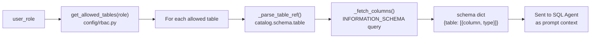

---

### `app.py` — Streamlit UI

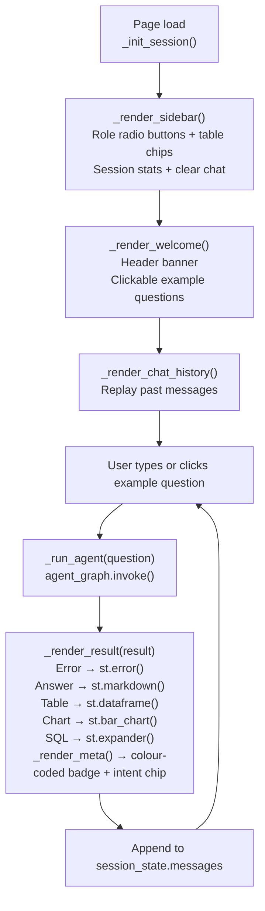

---

## 12. Environment & Configuration

### `.env` file (never commit)

```bash
ANTHROPIC_API_KEY=sk-ant-api03-xxxx
DATABRICKS_HOST=dbc-xxxxxxxx.cloud.databricks.com
DATABRICKS_TOKEN=dapi-xxxx
DATABRICKS_HTTP_PATH=/sql/1.0/warehouses/xxxx
```

### `config/settings.py`

All LLM, ChromaDB, and ingestion constants live here. No other file should hardcode model names, token limits, paths, or chunk sizes.

**LLM:**

| Constant | Value | Used in |
|---|---|---|
| `APP_MODEL` | `claude-haiku-4-5-20251001` | All LLM calls |
| `APP_MAX_TOKENS_SQL` | 600 | `sql_agent.py` — SQL generation |
| `APP_MAX_TOKENS_ANSWER` | 400 | `orchestrator.py` — doc answer node |
| `APP_MAX_TOKENS_FIX` | 500 | `db/execute.py` — self-correction |
| `APP_MAX_TOKENS_RESPONSE` | 300 | `response_agent.py` — DataFrame summary |
| `APP_MAX_TOKENS_EVAL` | 5 | `evaluator.py` — single-digit score |
| `APP_MAX_TOKENS_TABLE` | 20 | `metadata_agent.py` — table name extraction |

**Audit log:**

| Constant | Value | Used in |
|---|---|---|
| `AUDIT_CATALOG` | `data_assistant` | `utils/audit.py` |
| `AUDIT_SCHEMA` | `audit` | `utils/audit.py` |
| `AUDIT_TABLE` | `data_assistant.audit.query_audit_log` | `utils/audit.py` |

**ChromaDB:**

| Constant | Value | Used in |
|---|---|---|
| `CHROMA_PATH` | `data/chroma_db` | `retrieval_agent.py`, `data/ingest.py` |
| `CHROMA_COLLECTION` | `knowledge_base` | `retrieval_agent.py`, `data/ingest.py` |
| `CHROMA_N_RESULTS` | 3 | `retrieval_agent.py` |

**PDF ingestion:**

| Constant | Value | Used in | Notes |
|---|---|---|---|
| `DOCS_DIR` | `data/docs` | `data/ingest.py` | |
| `CHUNK_SIZE` | 800 | `data/ingest.py` | Max merge size reference — section splitter uses regex, not char count |
| `CHUNK_OVERLAP` | 0 | `data/ingest.py` | Section boundaries are natural delimiters |

---

## 13. Running the System

### First-time setup

```bash
# 1. Install dependencies
pip install -r requirements.txt

# 2. Copy and fill in your credentials
cp .env.example .env
# Edit .env with your Databricks + Anthropic keys

# 3. Place PDFs in data/docs/ then ingest them
python data/ingest.py

# 4. Verify Databricks connection
python -c "from db.connection import get_connection; print('Connected:', get_connection())"
```

### Daily use

```bash
# Launch the app
streamlit run app.py

# Run end-to-end tests (UC1–UC3)
python tests/test_graph.py
```

### Test the three use cases manually

| UC | Role | Question | Expected intent |
|---|---|---|---|
| UC1 | analyst | "What is Average Order Value?" | `doc_lookup` |
| UC2 | finance | "What is the Average Days to Ship for Q3 1996?" | `kpi_compute` |
| UC3 | finance | "What was total revenue by nation last year?" | `sql_query` |

---

## Section 14 — Evaluation Framework

### Overview

The project has two evaluation layers:

| Layer | Where it runs | Purpose |
|---|---|---|
| **Inline evaluator** (`agents/evaluator.py`) | Inside every user query (LangGraph node) | Quality gate — scores response before display |
| **Offline eval suite** (`evaluation/run_eval.py`) | Run manually / in CI | KPI measurement across 9 test cases |

---

### 14.1 Inline Evaluator Node

The evaluator is the last LangGraph node before `END`. It runs after `format_response` and adds two fields to `AgentState`:

| Field | Type | Meaning |
|---|---|---|
| `eval_score` | `int` (0–5) | Confidence score shown to user |
| `eval_notes` | `list[str]` | Human-readable flags (e.g. "empty result") |

**Scoring logic (in order):**

```
1. RBAC violation in error?  →  eval_score = 0  (Access Denied)
2. Any other execution error? →  eval_score = 1  (Error)
3. SQL query returned empty?  →  eval_score = LLM_relevance - 1  (penalty)
4. Normal response           →  eval_score = LLM_relevance(question, answer)
```

**LLM-as-judge prompt** (Haiku, max 5 tokens):
```
Rate the relevance of this answer to the question on a scale of 1-5.
5=Directly and completely answers  4=Mostly answers  3=Partially
2=Tangentially related  1=Irrelevant or empty

Question: {question}
Answer: {answer[:400]}

Return ONLY a single digit (1-5).
```

**Score labels shown in UI:**

| Score | Label | Meaning |
|---|---|---|
| 0 | Blocked | RBAC violation — access denied |
| 1 | Error | Execution failure |
| 2 | Low | Answer unlikely to satisfy user |
| 3 | Moderate | Partially addresses question |
| 4 | Good | Mostly correct and relevant |
| 5 | High | Directly and completely answers |

**Updated LangGraph flow:**
```
format_response → evaluate_result → END
```

---

### 14.2 Offline Evaluation Suite

**File:** `evaluation/run_eval.py`  
**Command:** `python evaluation/run_eval.py`

Runs 6 test cases (3 primary + 3 supplementary) and reports 5 KPIs.

**Test cases (`evaluation/test_cases.py`):**

| # | Description | Role | Intent | RBAC expected |
|---|---|---|---|---|
| 1 | KPI Definition Lookup | analyst | doc_lookup | OK |
| 2 | KPI Computation — Avg Days to Ship for Q3 1996 | finance | kpi_compute | OK |
| 3 | NL-SQL Query — Revenue by Nation | finance | sql_query | OK |
| 4 | RBAC Violation — Finance → Customer | finance | sql_query | Blocked |
| 5 | Supply Chain SQL (top suppliers) | finance | sql_query | OK |
| 6 | Metric Definition Lookup | executive | doc_lookup | OK |

**5 KPIs reported:**

```
Intent Accuracy   : % of cases where intent was classified correctly
RBAC Compliance   : % of cases where RBAC outcome matched expectation
SQL Accuracy      : % of sql_query cases that executed without unexpected error
Avg Relevance     : average eval_score from inline evaluator (LLM-as-judge, 1-5)
Avg Latency       : average seconds per query (end-to-end including evaluator)
```

**Baseline results (April 2026, pre-optimisation):**
```
Intent Accuracy   : 100.0%
RBAC Compliance   : 100.0%
SQL Accuracy      : 100.0%
Avg Relevance     : 4.67/5
Avg Latency       : 15.7s
```

**Post-optimisation (June 2026):**
```
Avg Latency       : ~6–9s (after schema caching, ChromaDB singleton,
                           section-based chunking, guardrail short-circuit)
```

**Latency optimisations applied:**

| Optimisation | File changed | Saving |
|---|---|---|
| Schema cached per role in memory | `db/schema.py` | 4–10s (dominant bottleneck) |
| ChromaDB module-level singleton | `agents/retrieval_agent.py` | 1–3s |
| Section-based chunking (20 chunks vs 57) | `data/ingest.py` | 0.5–2s (smaller prompts) |
| Guardrail short-circuit for off-topic queries | `agents/guardrail.py` | full pipeline skipped |

**Scoring modules (`evaluation/scorer.py`):**

| Function | Type | Description |
|---|---|---|
| `score_intent(actual, expected)` | rule-based | exact match |
| `score_rbac(error, expected_ok)` | rule-based | checks for "rbac violation" in error string |
| `score_sql(error, intent, expected_ok)` | rule-based | error=="" for sql_query (RBAC blocks count as OK) |
| `aggregate_metrics(results)` | computation | returns the 5 KPI dict |

