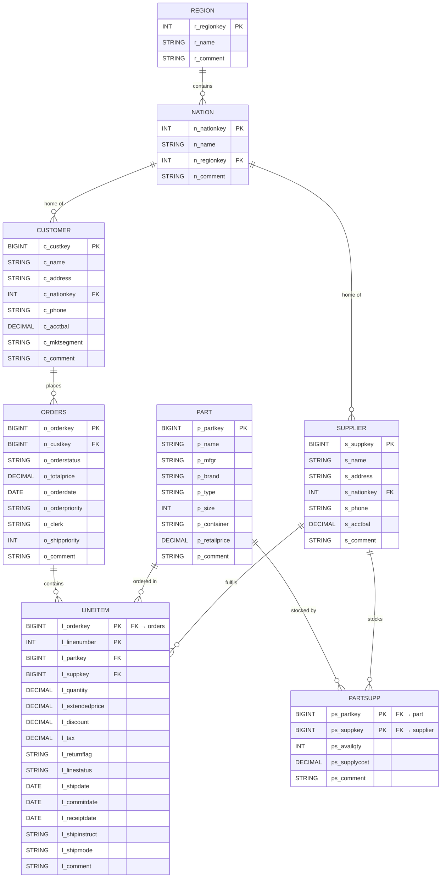

# TPC-H Entity-Relationship Diagram

> Catalog: `samples` · Schema: `tpch` · Total tables: 8 · Approx total rows: ~7.5 million

---

## ER Diagram



---

## Table Summary

| Table | Full name | PK | Approx rows | Purpose |
|---|---|---|---|---|
| `region` | `samples.tpch.region` | `r_regionkey` | 5 | 5 world regions (AFRICA, AMERICA, ASIA, EUROPE, MIDDLE EAST) |
| `nation` | `samples.tpch.nation` | `n_nationkey` | 25 | 25 countries, each belonging to a region |
| `customer` | `samples.tpch.customer` | `c_custkey` | ~150,000 | Customer master — name, address, market segment, nation |
| `supplier` | `samples.tpch.supplier` | `s_suppkey` | ~10,000 | Supplier master — name, address, nation |
| `part` | `samples.tpch.part` | `p_partkey` | ~200,000 | Product catalogue — brand, type, size, retail price |
| `partsupp` | `samples.tpch.partsupp` | `ps_partkey + ps_suppkey` | ~800,000 | Which supplier stocks which part, at what cost and qty |
| `orders` | `samples.tpch.orders` | `o_orderkey` | ~1,500,000 | One row per customer order — date, status, priority |
| `lineitem` | `samples.tpch.lineitem` | `l_orderkey + l_linenumber` | ~6,000,000 | One row per line within an order — price, discount, ship date |

---

## Foreign Key Reference

| Child table | Child column | Parent table | Parent column | Relationship |
|---|---|---|---|---|
| `nation` | `n_regionkey` | `region` | `r_regionkey` | Many nations → one region |
| `customer` | `c_nationkey` | `nation` | `n_nationkey` | Many customers → one nation |
| `supplier` | `s_nationkey` | `nation` | `n_nationkey` | Many suppliers → one nation |
| `orders` | `o_custkey` | `customer` | `c_custkey` | Many orders → one customer |
| `lineitem` | `l_orderkey` | `orders` | `o_orderkey` | Many line items → one order |
| `lineitem` | `l_partkey` | `part` | `p_partkey` | Many line items → one part |
| `lineitem` | `l_suppkey` | `supplier` | `s_suppkey` | Many line items → one supplier |
| `partsupp` | `ps_partkey` | `part` | `p_partkey` | Many partsupp rows → one part |
| `partsupp` | `ps_suppkey` | `supplier` | `s_suppkey` | Many partsupp rows → one supplier |

---

## Common Join Paths

These are the join chains needed for the most frequent analytics queries in this system.

### Revenue by Nation
```sql
lineitem
  JOIN orders   ON l_orderkey  = o_orderkey
  JOIN customer ON o_custkey   = c_custkey
  JOIN nation   ON c_nationkey = n_nationkey
```

### Revenue by Region
```sql
lineitem
  JOIN orders   ON l_orderkey  = o_orderkey
  JOIN customer ON o_custkey   = c_custkey
  JOIN nation   ON c_nationkey = n_nationkey
  JOIN region   ON n_regionkey = r_regionkey
```

### Supplier Revenue / Performance
```sql
lineitem
  JOIN supplier ON l_suppkey   = s_suppkey
  JOIN nation   ON s_nationkey = n_nationkey
```

### Supply Cost
```sql
partsupp
  JOIN supplier ON ps_suppkey = s_suppkey
  JOIN part     ON ps_partkey = p_partkey
```

### Average Days to Ship
```sql
lineitem
  JOIN orders ON l_orderkey = o_orderkey
-- AVG(DATEDIFF(l_shipdate, o_orderdate))
```

### Average Order Value (AOV)
```sql
lineitem
  JOIN orders ON l_orderkey = o_orderkey
-- SUM(l_extendedprice * (1 - l_discount)) / COUNT(DISTINCT o_orderkey)
```

---

## Key Column Notes

| Column | Table | Notes |
|---|---|---|
| `l_extendedprice` | lineitem | Base revenue per line item (quantity × part price before discount) |
| `l_discount` | lineitem | Fractional discount: 0.00–0.10. Net revenue = `l_extendedprice * (1 - l_discount)` |
| `o_orderdate` | orders | Date range: 1992–1998. Use for order-level time filters |
| `l_shipdate` | lineitem | Date item was shipped. Use for shipment-level time filters |
| `o_orderstatus` | orders | `O` = Open, `F` = Fulfilled, `P` = Partially shipped |
| `l_returnflag` | lineitem | `A` = Accepted, `R` = Returned, `N` = None |
| `c_mktsegment` | customer | `AUTOMOBILE`, `BUILDING`, `FURNITURE`, `HOUSEHOLD`, `MACHINERY` |
| `ps_supplycost` | partsupp | Cost per unit from a specific supplier for a specific part |

---

## Date Filtering Convention

The TPC-H dataset covers **1992–1998**. When users say "last year" or "recent", interpret as:

| Expression | SQL filter |
|---|---|
| "last year" | `YEAR(o_orderdate) = 1997` |
| "this year" | `YEAR(o_orderdate) = 1998` |
| "Q1 1995" | `o_orderdate BETWEEN '1995-01-01' AND '1995-03-31'` |
| "Q3 1996" | `o_orderdate BETWEEN '1996-07-01' AND '1996-09-30'` |

> Always use `o_orderdate` for order-level queries and `l_shipdate` for shipment-level queries.
